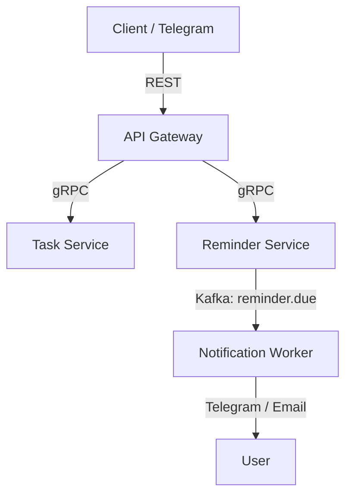

# 🧠 TaskBoard — сервис задач и напоминаний на Go

TaskBoard — это сервис-ориентированное приложение для управления задачами, напоминаниями и уведомлениями, написанное на Go. Использует современные подходы: gRPC, Kafka, PostgreSQL, Docker и Telegram-интеграцию.

---

## 🚀 Возможности

- 📋 Управление задачами (CRUD, теги, статусы, дедлайны)
- ⏰ Напоминания (одноразовые и повторяющиеся)
- 🔔 Уведомления через Telegram, email, push
- 📊 Статистика и история выполнения
- 📡 Внешний REST API + внутреннее gRPC-взаимодействие
- 💬 Интеграция с Telegram-ботом

---

## 🧱 Архитектура

Проект разделён на микросервисы, каждый из которых выполняет отдельную функцию. Внешние клиенты работают через REST API Gateway, внутренние — через gRPC и Kafka.

```
├── cmd/
│   ├── api-gateway/          # REST HTTP сервер, адаптирует запросы к gRPC
│   ├── task-service/         # сервис задач
│   ├── reminder-service/     # сервис напоминаний и их отправки
│   └── notification-worker/  # консьюмер Kafka, отправка напоминаний
│
├── proto/                    # .proto файлы для gRPC
│
├── internal/
│   ├── common/               # shared код: модели, утилиты
│   ├── clients/              # gRPC-клиенты к другим сервисам
│   ├── kafka/                # обёртки и продюсеры Kafka
│   └── config/               # загрузка конфигов
│
├── deploy/
│   ├── docker/               # Dockerfile и Compose-файлы
│   └── ci-cd/                # CI/CD скрипты (GitHub Actions, GitLab CI)
│
├── scripts/                  # миграции, генераторы, вспомогательные скрипты
│
├── docs/                     # Swagger, диаграммы, схемы API
│
└── README.md                 # описание проекта
```

## 📡 Взаимодействие сервисов

